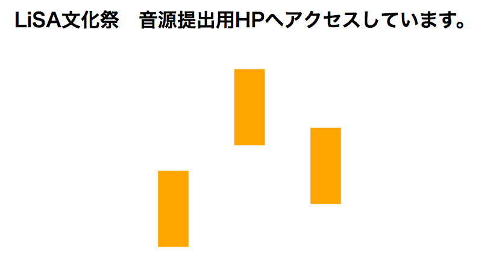
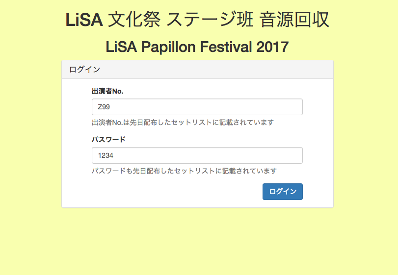
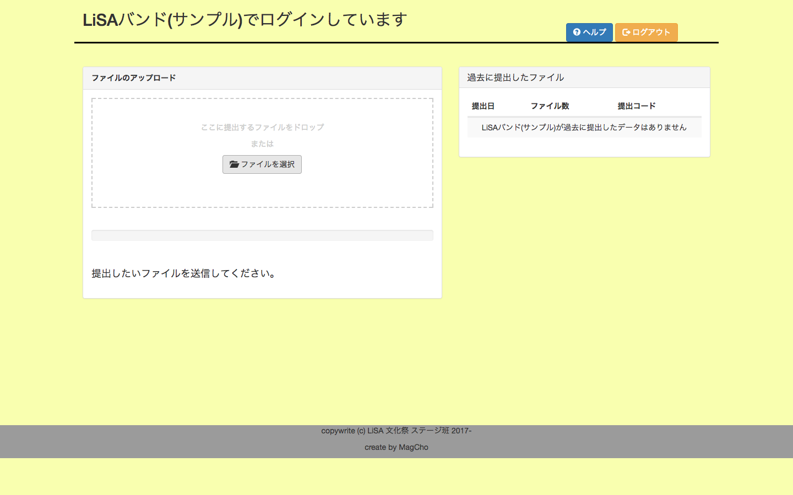
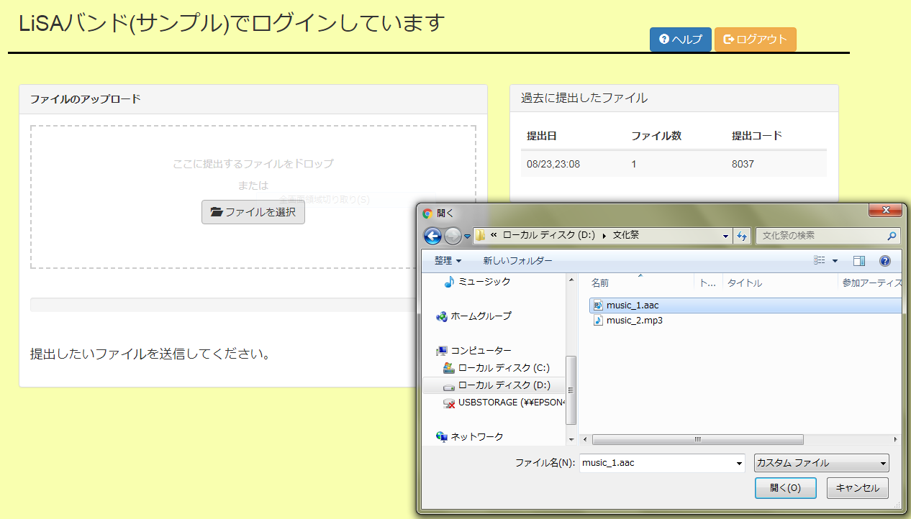
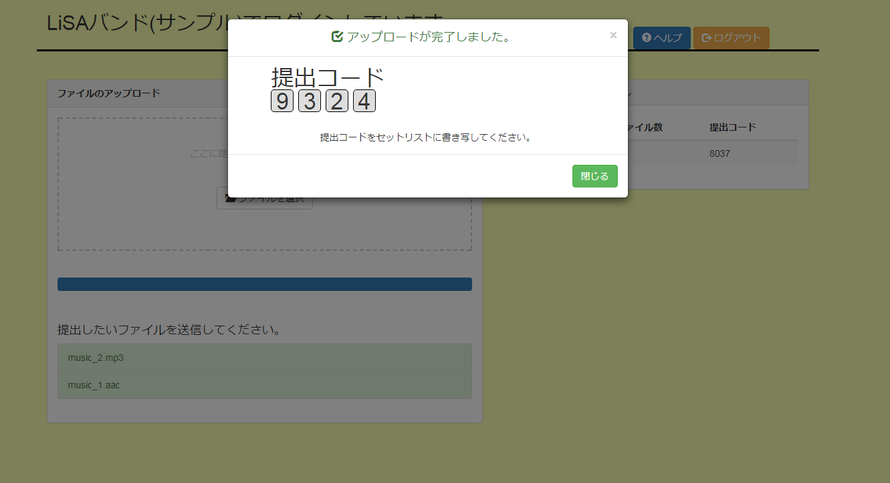

# 文化祭ステージ　音源提出HELP

## 提出の仕方

1. 「[http://lisa2017stage.xyz](http://lisa2017stage.xyz)にアクセスします」

  

  ※ サーバー起動のため10秒ほどお待ちください。

1. ログインします

  

  ログインID、パスワードはセットリストに記載されています。

1. ログイン後、画面に表示された団体名が正しいものかどうか確認してください

  

1. 画面左のアップロードフォームにファイルをDrag&Dropするか、[ファイルを選択]から提出したいファイルを選択してください

  

  - 複数ファイルのアップロードが可能です。
  - アップロードできるファイルはAAC MP3のみです
  - 提出できるファイルの大きさは合計して１団体あたり50MBまでです

1. 正しく提出が完了すると**提出コード**が発行されます、このコードをセットリストに書き写してください

  

## Q&A

### **Q1**　スマートフォンでの提出は可能ですか？
### **A1**　可能です。

  スマートフォンでも同様の操作で音源を提出することができます。

  ※ 提出できるファイルはAAC, MP3のみです。動画ファイルをアップロードすることはできません。

---
### **Q2**　ファイルを選択したのにアップロードが始まらない
### **A2**　違うブラウザでお試しください

  お使いのブラウザがファイルアップロードに対応していない可能性があります。

  以下の環境での動作を確認しています
  - Chrome windows7
  - Safari macOS
  - Chrome macOS
---

### **Q3**　間違ったファイルをアップロードしてしまった
### **A3**　一度ログアウトし、改めて正しいファイルをアップロードしてください

  アップロードしたファイルを削除する機能はありません、ログインするたびに提出コードが変わりますので再ログイン後に改めて正しいファイルをアップロードしてください。

---

### **Q4**　ファイルを追加したい
### **A4**　アップロードし、セットリストに提出コードを2つ書いてください

  ログインするたびに提出コードは変わります、追加でアップロードした場合は最初の提出コードを消さずに、新しいコードを書き足してください。

---

### **Q5**　ファイルの合計が50MBを超えてしまう
### **A5**　音質を下げるなど、ファイルサイズを減らしてください

  合計50MB(52,428,800B)を超える場合はエンコードソフトなどを用いて音質を下げるなどして、ファイルサイズを減らしてください。

---
### **Q6**　ログインできない
### **A6**　文化祭ステージ班、もしくはLBT部にお問い合わせください

  以下のことを確認し、それでもログインできない場合は文化祭ステージ班、もしくはLBT部にお問い合わせください。

  - セットリストに記載されているものを正しく入力している
  - 他のブラウザやコンピュータからログインしてみる
  - サイトをリロード(再読み込み)してみる
